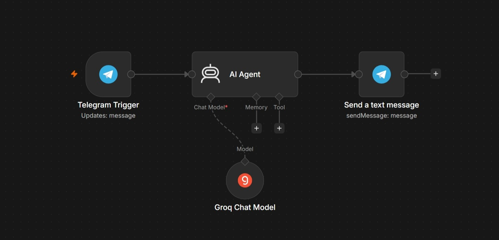

# **Telegram AI Chatbot using n8n and Groq**


An automated Telegram chatbot built using n8n, powered by Groq's Qwen model via a Langchain AI Agent. This bot listens to incoming Telegram messages, processes them using an AI model, and replies back instantly.

## **Workflow Preview**

<p align="center">
  
</p>

## Tech Stack

| Technology | Purpose |
|------------|---------|
| n8n | Workflow Automation Platform |
| Telegram Bot API | Receiving and Sending Messages |
| Groq API | LLM Inference (Qwen 3.8-27B) |
| Langchain AI Agent | AI Logic and Response Generation |

## How It Works

1. User sends a message on Telegram
2. Telegram Trigger node captures the incoming message
3. AI Agent node processes the text using Groq Chat Model
4. The generated response is sent back to the user via Telegram

## Setup Instructions

 ### 1. Clone this repository
   ```bash
   git clone https://github.com/hithursan/Telegram-AI-chatbot.git
   ```
 ### 2. Import the workflow
    Open your n8n instance<br>
    Go to Workflows then Import from File
    Select workflow.json

### 3. Set up credentials

    Telegram Bot API Token (via BotFather)
    Groq API Key (from Groq Console)
### 4. Activate the workflow in n8n

### 5. Test it by sending a message to your Telegram bot to get an AI-powered response instantly.

## Project Structure
```
telegram-ai-chatbot/
├── workflow.json              n8n workflow export
├── README.md                  Project documentation
├── .gitignore                 Ignored files
└── images/
    └── workflow-screenshot.png
```
##  Author

**Hithursan Navaretnarasa**

---
<div align="center" font-wight=800>
Crafted with ❤️ for the modern connoisseu#
</div>
